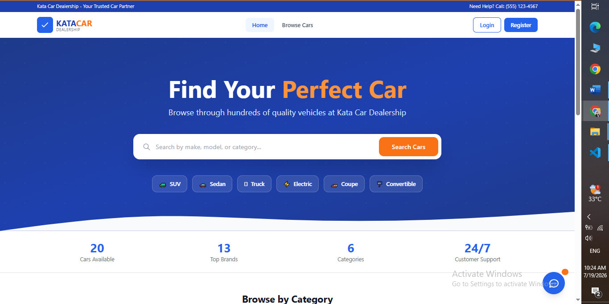
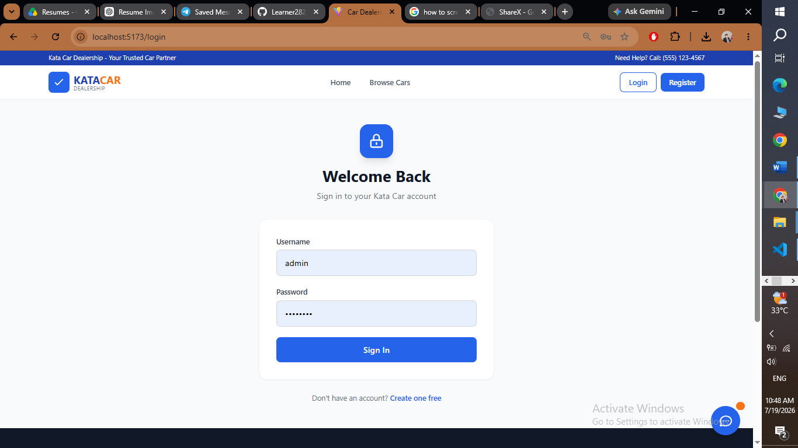
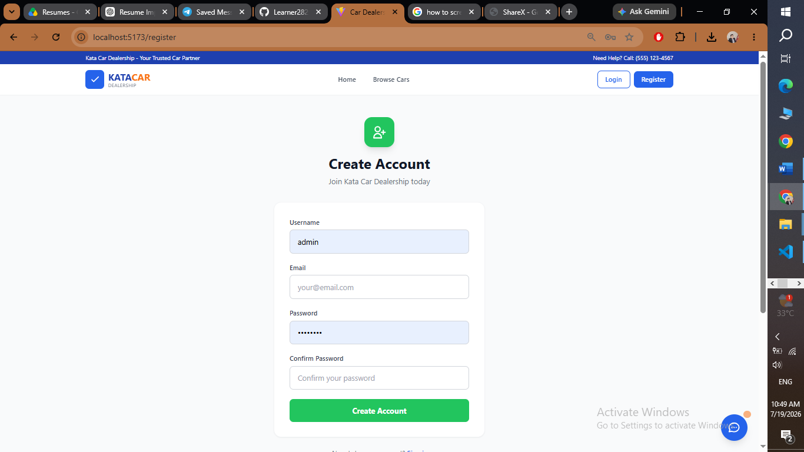
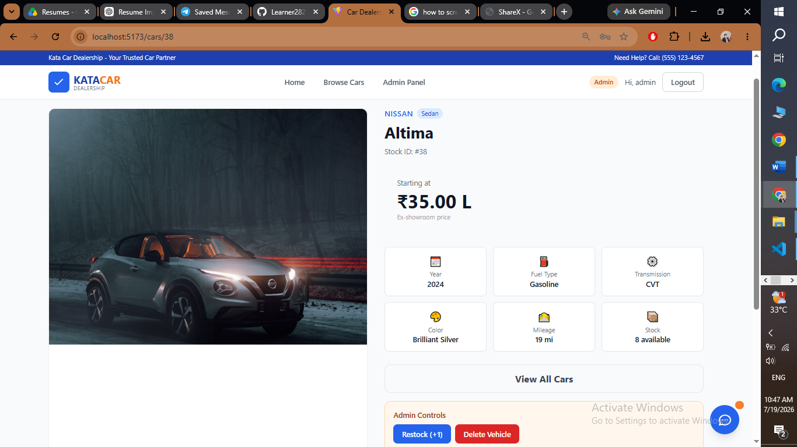
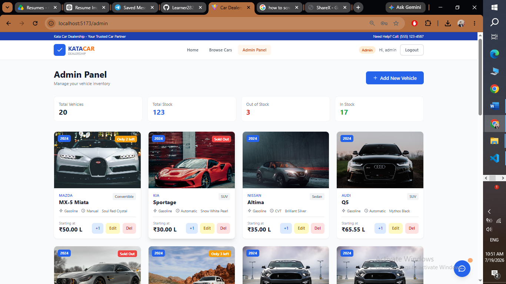
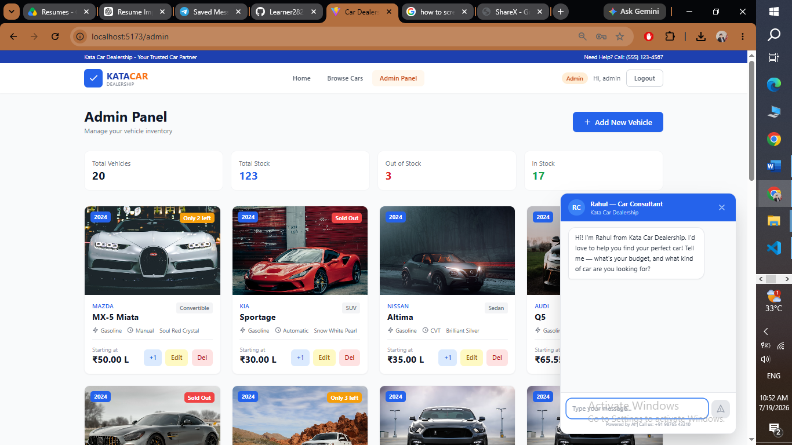

# Car Dealership Inventory System

A full-stack application for managing a car dealership's vehicle inventory, built with Django REST Framework (backend) and React (frontend) using Test-Driven Development (TDD). Features an AI-powered sales chatbot and Indian Rupee (₹) pricing.

## Tech Stack

| Layer | Technology |
|-------|-----------|
| Backend | Django 6.0.7, Django REST Framework 3.17.1 |
| Frontend | React 18, Vite 6, Tailwind CSS 3 |
| Auth | djangorestframework-simplejwt (JWT) |
| AI Chat | HuggingFace Inference API (DeepSeek-R1-0528) |
| Database | SQLite (dev) / PostgreSQL (prod) |
| Testing | Django TestCase (42 tests), Vitest + Testing Library (39 tests) |

## Features

- **User Authentication** - Register, login, and JWT-based session management
- **Role-Based Access** - Standard users (buyers) and admin users (staff)
- **Vehicle CRUD** - Full create, read, update, delete operations (admin only for write)
- **Search & Filter** - Filter vehicles by make, model, category, and price range
- **Purchase Flow** - Buyers can purchase vehicles (stock decreases automatically)
- **Admin Dashboard** - Add, edit, delete vehicles, and restock inventory
- **AI Sales Chatbot** - Floating chat widget with a virtual salesperson (Rahul) who answers vehicle queries using real inventory data
- **Indian Rupee Pricing** - All prices displayed in ₹/Lakh/Crore format
- **Responsive UI** - Clean, mobile-friendly CardDekho-inspired design with Tailwind CSS

## Project Structure

```
AI_Kata_Car_Dealership_inventory_System/
├── config/              # Django project settings
├── accounts/            # User model, auth endpoints, tests
├── inventory/           # Vehicle model, CRUD, search, purchase, tests
├── chat/                # AI chatbot proxy, sales prompt, tests
├── frontend/            # React SPA
│   └── src/
│       ├── components/  # Login, Register, Home, BrowseCars, CarDetail, AdminPanel, VehicleCard, VehicleForm, SearchBar, Navbar, ChatBot
│       ├── context/     # AuthContext (JWT state management)
│       ├── services/    # Axios API client with JWT interceptor
│       └── utils/       # formatIndianCurrency helper
├── manage.py
├── requirements.txt
├── .gitignore
├── README.md
└── PROMPTS.md           # AI tooling chat history
```

## API Endpoints

| Method | Endpoint | Description | Auth |
|--------|----------|-------------|------|
| POST | `/api/auth/register/` | Register new user | Public |
| POST | `/api/auth/login/` | Login, returns JWT | Public |
| POST | `/api/auth/token/refresh/` | Refresh access token | Public |
| GET | `/api/vehicles/` | List all vehicles | Public |
| POST | `/api/vehicles/` | Create vehicle | Admin |
| GET | `/api/vehicles/search/` | Search/filter vehicles | Public |
| GET | `/api/vehicles/<id>/` | Get vehicle detail | Public |
| PUT | `/api/vehicles/<id>/` | Update vehicle | Admin |
| DELETE | `/api/vehicles/<id>/` | Delete vehicle | Admin |
| POST | `/api/vehicles/<id>/purchase/` | Purchase vehicle | JWT |
| POST | `/api/vehicles/<id>/restock/` | Restock vehicle | Admin |
| POST | `/api/chat/` | Chat with AI salesperson | Public |

## Setup & Installation

### Backend

```bash
# Create and activate virtual environment
python -m venv venv
venv\Scripts\activate       # Windows
source venv/bin/activate    # macOS/Linux

# Install dependencies
pip install -r requirements.txt

# Run migrations
python manage.py migrate

# Create admin user
python manage.py createsuperuser

# Load sample vehicles (20 vehicles with Indian pricing)
python manage.py load_vehicles

# Start backend server
python manage.py runserver
```

### Frontend

```bash
cd frontend

# Install dependencies
npm install

# Start dev server (proxies /api to Django backend)
npm run dev
```

The app runs at `http://localhost:5173` (frontend + API proxy).

## Screenshots

### Home Page


### Login Page


### Registration Page


### Vehicle Detail


### Admin Panel


### AI Chatbot


## Test Report

### Backend Tests: 42/42 Passing

```
Ran 42 tests in 146.343s
OK
```

#### Test Breakdown - `accounts` app (9 tests):

| Test | Description | Result |
|------|-------------|--------|
| `test_create_standard_user` | Creating a buyer with default permissions | PASS |
| `test_create_admin_user` | Creating an admin with staff privileges | PASS |
| `test_user_str_representation` | CustomUser __str__ returns username | PASS |
| `test_user_registration` | POST /api/auth/register/ creates user | PASS |
| `test_user_login` | POST /api/auth/login/ returns JWT | PASS |
| `test_duplicate_username_registration` | Duplicate username returns 400 | PASS |
| `test_missing_fields_registration` | Missing fields returns 400 | PASS |
| `test_invalid_login_credentials` | Wrong password returns 401 | PASS |
| `test_token_refresh` | POST /api/auth/token/refresh/ returns new token | PASS |

#### Test Breakdown - `inventory` app (25 tests):

| Test | Description | Result |
|------|-------------|--------|
| `test_create_vehicle_successful` | Vehicle created with all required fields | PASS |
| `test_vehicle_string_representation` | __str__ returns "Make Model" | PASS |
| `test_vehicle_default_quantity` | Quantity defaults to zero | PASS |
| `test_get_vehicles_authenticated` | Buyer can list vehicles (200) | PASS |
| `test_get_vehicles_unauthenticated` | Unauthenticated users can browse (public) | PASS |
| `test_create_vehicle_admin` | Admin can create vehicle (201) | PASS |
| `test_create_vehicle_buyer_forbidden` | Buyer gets 403 on create | PASS |
| `test_retrieve_vehicle_detail` | Any user can get single vehicle | PASS |
| `test_retrieve_vehicle_not_found` | Non-existent vehicle returns 404 | PASS |
| `test_update_vehicle_admin` | Admin can update via PUT | PASS |
| `test_partial_update_vehicle_admin` | Admin can partial update via PATCH | PASS |
| `test_update_vehicle_buyer_forbidden` | Buyer gets 403 on update | PASS |
| `test_delete_vehicle_admin` | Admin can delete vehicle (204) | PASS |
| `test_delete_vehicle_buyer_forbidden` | Buyer gets 403 on delete | PASS |
| `test_search_vehicles_by_make` | Search filters by make | PASS |
| `test_search_vehicles_by_model` | Search filters by model | PASS |
| `test_search_vehicles_by_category` | Search filters by category | PASS |
| `test_search_vehicles_by_price_range` | Search filters by price range | PASS |
| `test_search_vehicles_multiple_filters` | Combined filters work | PASS |
| `test_search_no_results` | Empty list when nothing matches | PASS |
| `test_purchase_vehicle_success` | Purchase decreases stock by 1 | PASS |
| `test_purchase_out_of_stock_vehicle` | Out of stock returns 400 | PASS |
| `test_purchase_nonexistent_vehicle` | Non-existent vehicle returns 404 | PASS |
| `test_restock_vehicle_admin_success` | Admin can restock (increases by 1) | PASS |
| `test_restock_vehicle_buyer_forbidden` | Buyer gets 403 on restock | PASS |

#### Test Breakdown - `chat` app (8 tests):

| Test | Description | Result |
|------|-------------|--------|
| `test_chat_success_returns_reply` | Chat endpoint returns AI reply | PASS |
| `test_chat_missing_messages_field_returns_400` | Missing field returns 400 | PASS |
| `test_chat_empty_messages_returns_400` | Empty messages returns 400 | PASS |
| `test_chat_api_error_returns_502` | HuggingFace API error returns 502 | PASS |
| `test_chat_timeout_returns_504` | Timeout returns 504 | PASS |
| `test_chat_invalid_response_format_returns_502` | Bad response format returns 502 | PASS |
| `test_chat_strips_think_tags` | Removes `<think>` tags from reply | PASS |
| `test_chat_requires_no_authentication` | Chat is publicly accessible | PASS |

### Frontend Tests: 39/39 Passing

```
Test Files  7 passed (7)
     Tests  39 passed (39)
```

#### Test Breakdown:

| Component | Tests | Result |
|-----------|-------|--------|
| `Login.test.jsx` | Login form renders and submits credentials | 1/1 PASS |
| `Register.test.jsx` | Form renders, validation, API submission, error display | 4/4 PASS |
| `Navbar.test.jsx` | Auth state display, admin badge, logout | 5/5 PASS |
| `VehicleCard.test.jsx` | Vehicle details, purchase button, stock status, admin controls | 7/7 PASS |
| `VehicleForm.test.jsx` | Add/edit mode, validation, form submission, cancel | 5/5 PASS |
| `SearchBar.test.jsx` | Filter inputs, search submission, clear functionality | 5/5 PASS |
| `ChatBot.test.jsx` | Toggle, send message, loading state, empty input | 9/9 PASS |

### Total: 81/81 Tests Passing

## Default Test Credentials

| Role | Username | Password |
|------|----------|----------|
| Admin (staff) | `admin` | `admin123` |
| Buyer | `test` | `test123` |

---

## My AI Usage

### Tools Used

- **opencode (big-pickle model)** - Primary AI coding assistant used throughout development

### How I Used AI

1. **Bug Discovery and Fixing:** I asked the AI to investigate why the login page wasn't working. It explored the full codebase and identified 3 critical bugs that would have taken significant time to find manually:
   - Missing CORS middleware (`corsheaders.middleware.CorsMiddleware` not in Django's MIDDLEWARE list)
   - Missing `react`/`react-dom` npm packages (only `preact` was installed but all code imported from `react`)
   - Case-sensitive import mismatch (`./App.jsx` vs actual filename `app.jsx`)

2. **Full-Stack Feature Development:** I provided the complete requirements document and asked the AI to build the remaining features. It systematically:
   - Audited the current state (~35-40% complete)
   - Built 7 frontend components (Register, Navbar, VehicleCard, VehicleForm, SearchBar, Dashboard, updated app.jsx)
   - Updated AuthContext to decode JWT tokens for user role detection
   - Cleaned up 14 instances of dead/duplicate imports across 6 backend files
   - Created all supporting files (requirements.txt, .gitignore)

3. **AI Chatbot Development:** I asked the AI to build a personalized sales chatbot. It:
   - Created the `chat` Django app with a HuggingFace API proxy and salesperson system prompt
   - Built a floating React ChatBot widget with conversation UI and typing indicator
   - Diagnosed and fixed the HF_TOKEN bug (was a Python tuple instead of a string)
   - Added inventory context injection so the chatbot can reference real vehicles in stock

4. **Test Writing:** AI generated comprehensive test suites:
   - Expanded backend tests from 15 to 42 (added vehicle detail/update/delete, multi-filter search, duplicate registration, JWT refresh, 404 handling, 8 chat tests)
   - Expanded frontend tests from 1 to 39 (Register, Navbar, VehicleCard, VehicleForm, SearchBar, ChatBot)
   - Fixed jsdom 27.x ESM incompatibility by identifying the root cause and downgrading

5. **Documentation:** AI generated README.md, PROMPTS.md, and all structured documentation sections.

6. **Code Cleanup:** AI identified and cleaned duplicate imports, dead code, and boilerplate comments across the entire codebase.

### Impact on Workflow

- **Speed:** Went from "login page broken" to "full application with 81 passing tests" in a single session
- **Quality:** AI caught subtle issues like case-sensitive imports, duplicate variable definitions in settings.py, and missing CORS configuration
- **Test Coverage:** AI wrote meaningful edge-case tests (duplicate registration, permission checks, 404 handling, multi-filter search, chat error handling) that I would have likely overlooked
- **Consistency:** All generated code follows consistent patterns, naming conventions, and Tailwind CSS styling

### Reflection

AI was most valuable as a **pair programmer** - handling mechanical code generation, bug detection, and test writing while I focused on architecture decisions, requirements analysis, and quality verification. The AI accelerated development significantly but required careful review to ensure correctness and alignment with project requirements.

The main learning was that AI excels at pattern-based tasks (component generation, test boilerplate, code cleanup) but still requires human judgment for design decisions, business logic validation, and deployment configuration.

---

*Co-authored-by: AI Assistant <AI@users.noreply.github.com>*
